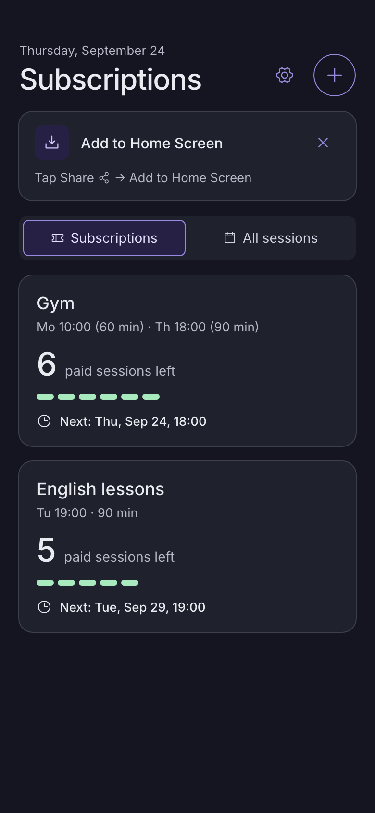
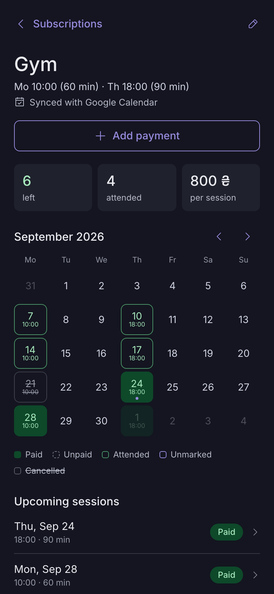
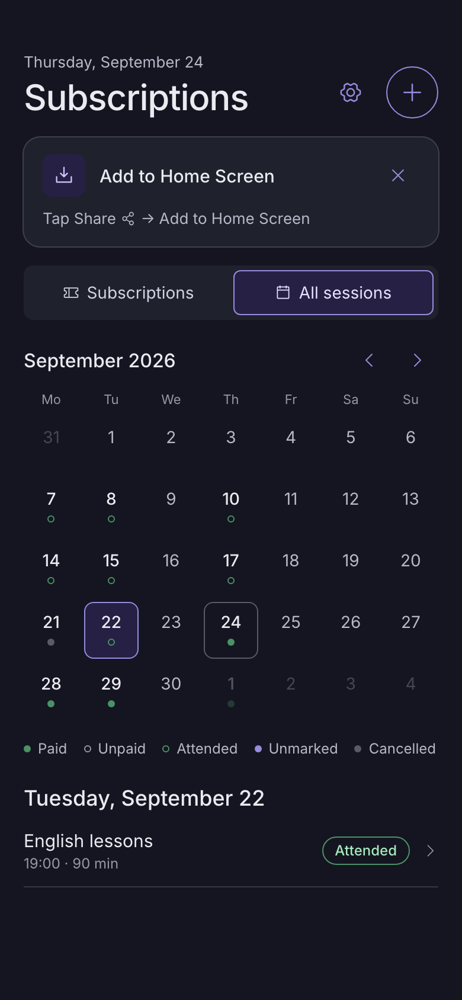
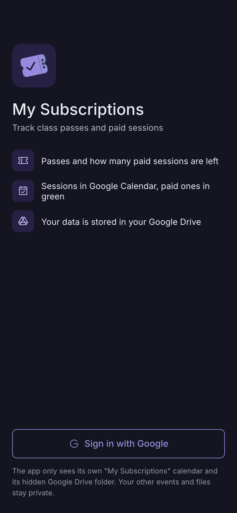
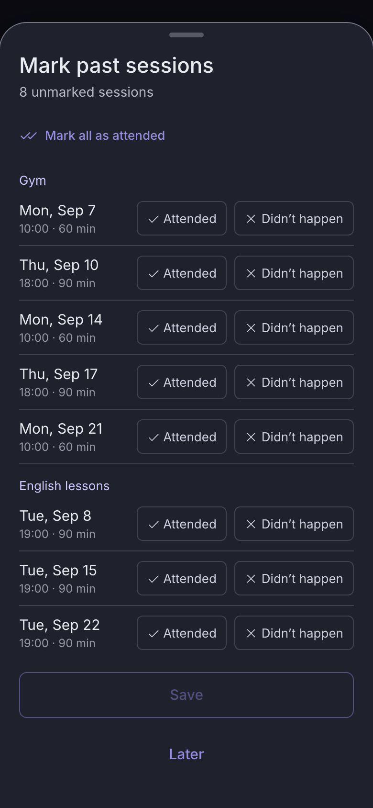
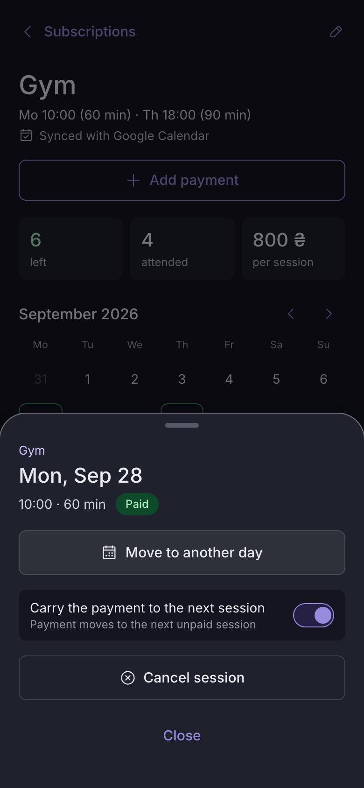
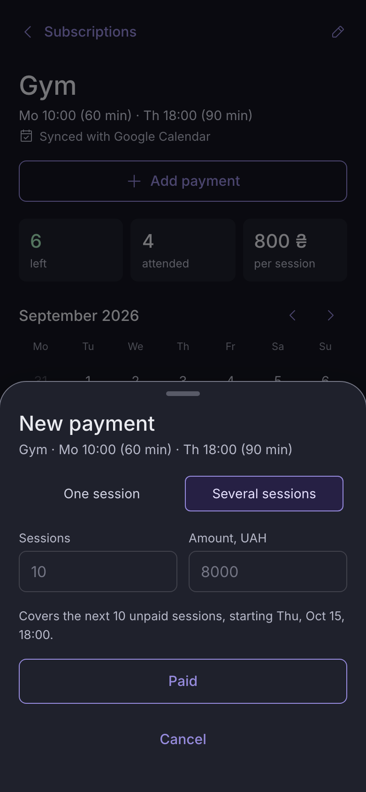
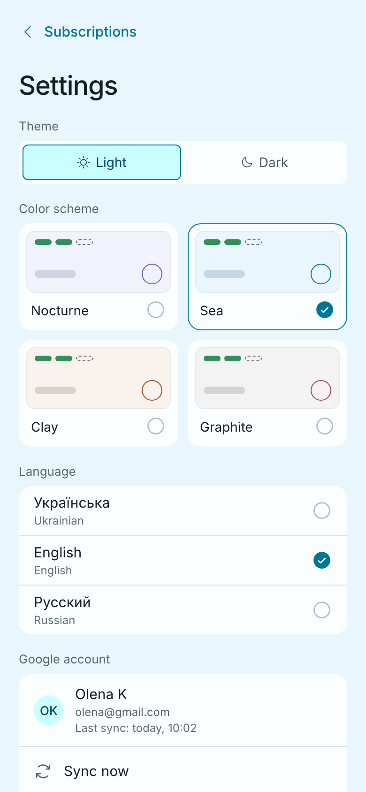

# My Subscriptions

**Track prepaid class passes — gym, lessons, any hobby — right from your phone.**

My Subscriptions shows how many paid sessions are left on each pass, asks after every session whether
you went, moves the payment on when a session is cancelled, and reminds you when it's time to renew.
Every session appears in your Google Calendar: paid ones in green, unpaid in grey.

It is a **PWA (Progressive Web App)** made for phones. You don't need an app store: open a link, add it to
the Home Screen, and it runs full screen like a regular app, offline too.

**Open the app:** https://vik753.github.io/my-subscriptions/

<p>
  
  
  
</p>

## Features

- **Passes at a glance:** for each hobby you see the paid sessions left, the next session and a
  "Renew soon" tag when one is left.
- **Attendance check when the app opens:** past sessions you haven't marked are listed, and you
  answer "Attended" or "Didn't happen". There are no push notifications and nothing runs in the
  background.
- **Payments carry over:** if a session didn't happen or you cancel it, the payment moves to the
  next session. You can also cancel without carrying it over (the session is deducted).
- **Move sessions:** move one session, or all following ones, to another day and time.
- **Renewal reminder:** when one paid session is left, the app suggests adding a payment. You can
  snooze it until tomorrow.
- **Google Calendar:** a separate "My Subscriptions" calendar with one event per session:
  - Paid sessions are green, unpaid grey, attended sage.
  - An optional popup reminder before each session is sent by Google Calendar.
- **Backup in your Google Drive:** your data lives in a hidden app folder in your own Drive.
  Several phones and computers stay in sync.
- **Works offline:** changes are saved on the device and sync when the internet is back.
- **Three languages** (Ukrainian, English, Russian), **light and dark themes**, **four color schemes**.

## Install

### iPhone / iPad (Safari)

1. Open https://vik753.github.io/my-subscriptions/ in **Safari**. If the link opened inside
   Telegram, Instagram or another app, choose **Open in Safari** first.
2. Tap **Share** (the square with an arrow) → **Add to Home Screen** → **Add**.
3. Start the app from its new icon on the Home Screen.

### Android (Chrome)

1. Open the link in **Chrome**.
2. Tap **Install** on the card at the top of the app (or ⋮ → **Install app**).
3. Start the app from its new icon.

### Computer (Chrome / Edge)

Open the link and click the install icon in the address bar, or just use it in a browser tab.
On wide screens the app shows as a centered column.

## Sign in



1. Tap **Sign in with Google** and choose your account.
2. Google may warn that **"Google hasn't verified this app"**. This is a family app that isn't
   published in a store. Tap **Advanced → Go to My Subscriptions**.
3. Allow both permissions:
   - **Calendar:** only the app's own "My Subscriptions" calendar. Your other calendars stay private.
   - **Google Drive:** only the app's hidden folder. Your files stay private.

The app has no server. Your data stays on your device and in your own Google account; nobody else,
including the author, can see it.

<br clear="right">

## How to use

### 1. Add a hobby

Tap **+** on the Home screen and fill in:

- the name;
- the days of the week, with a time and duration for each;
- the date of the first session;
- how many sessions the pass has and what it cost.

The summary under the form shows what will be created. **Create and add to calendar** creates the
hobby, and its sessions appear in Google Calendar a moment later.

To change the schedule later, open the hobby → ✏️. Changes apply from the date you choose; past
sessions and marks stay as they are.

### 2. Mark sessions after they happen



When you open the app after a session, it asks **"Did you attend the session?"**. If several
sessions are waiting, you get a list instead:

- **Attended** uses one paid session.
- **Didn't happen** keeps the payment, which moves to the next session.
- **Later** hides the question until the next time you open the app. Unmarked sessions show an
  "Unmarked" tag on the card and an outlined day with a dot in the calendar.

<br clear="right">

### 3. Look at a hobby

Tap a card to see:

- the paid sessions left, the sessions attended and the price per session;
- a month calendar: green = paid, dashed = unpaid, outlined = attended, crossed out = cancelled;
- the upcoming sessions, the history and the payments.

### 4. Cancel, move or restore a session



Tap a session in the calendar or in **Upcoming sessions**:

- **Move to another day:** pick a date and time. Turn on **"Also move all following sessions on
  this day"** to change the schedule from then on.
- **Cancel session:** by default the payment moves to the next unpaid session. Turn the switch off
  to deduct the session from the pass instead.
- **Restore session:** tap a cancelled session to undo the cancellation.

<br clear="right">

### 5. Add a payment



Tap **Add payment** on the hobby. Choose one of:

- **One session:** a single paid session.
- **Several sessions:** a new pass.

Empty fields repeat your last payment. The hint shows which sessions the payment will cover, and
they turn green in the app and in Google Calendar.

When only one paid session is left, the app suggests this by itself. **Remind me later** snoozes it
until tomorrow.

<br clear="right">

### 6. See all hobbies together

The **All sessions** tab on the Home screen puts every session of every hobby on one month calendar.
Tap a day to see its sessions, and tap a session to open its hobby.

### 7. Settings



Tap ⚙️ on the Home screen:

- **Theme** (light / dark), **color scheme** (Nocturne, Sea, Clay, Graphite) and **language**.
- **Google account:** the time of the last sync, **Sync now** and **Sign out**.
- **Reminder before session:** a Google Calendar popup 15, 30 or 60 minutes before each session.
- **Install the app** (if it isn't installed yet), **About**, and **Delete all data**, which
  removes your hobbies, the "My Subscriptions" calendar and the Drive backup.

<br clear="right">

### Good to know

- **Sync status:** the hobby screen shows "Synced with Google Calendar". "Offline — changes will
  sync later" means you have no internet right now.
- **"Sign in again to sync":** Google sessions expire from time to time. Tap **Sign in**; your data
  stays on the phone meanwhile.
- **Several devices:** sign in with the same Google account and your data is merged automatically.
- **Updates:** when a new version is out, a banner appears at the top. Tap **Update**.

## Questions and support

Write to vik753@gmail.com (also in Settings → About → Contact support). A short guide to send to
family and friends is in [`docs/family-guide.md`](docs/family-guide.md).

---

## For developers

- Stack: Vite, React, TypeScript (strict), vite-plugin-pwa (Workbox), React Router, Zustand,
  IndexedDB (`idb`), Vitest + Testing Library, Playwright (WebKit + Chromium), CSS Modules.
- Google only: OAuth 2.0 token flow in the browser (no client secret, no backend). Scopes are
  `calendar.app.created` and `drive.appdata`.
- The product spec is [`design_handoff_my_subscriptions/README.md`](design_handoff_my_subscriptions/README.md)
  plus [`docs/design-review.md`](docs/design-review.md). The plan is [`docs/roadmap.md`](docs/roadmap.md).
  Engineering rules are in [`CLAUDE.md`](CLAUDE.md).

### Run locally

Requires Node 24 (`nvm use`).

```sh
npm ci
cp .env.example .env.local   # set VITE_GOOGLE_CLIENT_ID
npm run dev
```

Checks: `npm run typecheck`, `npm run lint`, `npm test`, `npm run test:coverage`
(`src/domain` must stay at 100%), `npm run test:e2e`.

### How it works

Everything derives from one pure function. `summarize(hobby, now)` in `src/domain` generates
the sessions and their statuses from the schedule, payments and marks.

1. A change is saved to IndexedDB first.
2. The sync pass merges the Drive copy of `state.json` (per hobby, with tombstones for deleted ones).
3. It writes only the calendar events whose content changed, using deterministic event ids, so
   retrying a write never creates duplicates.
4. It uploads the backup if it changed.

### Screenshots

The images in `docs/screenshots/` come from a real build with Google faked:

```sh
BASE_PATH=/ npm run build && npx vite preview --port 4173 &
node scripts/capture-screenshots.mjs
```

### Workflow

Work happens on `dev`. `main` receives changes only through pull requests with green CI and deploys
to GitHub Pages.
